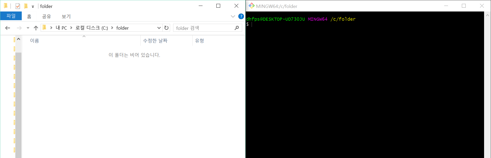
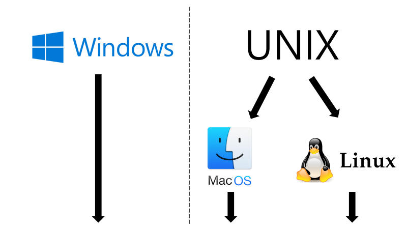

# Git 특강 - Day 1


## 목차
[1. CLI 기초](https://github.com/oypark/TIL/blob/master/git-special-lecture/220209_day1.md#1-cli-%EA%B8%B0%EC%B4%88)
​	[1) Git 설치](https://github.com/oypark/TIL/blob/master/git-special-lecture/220209_day1.md#1-git-%EC%84%A4%EC%B9%98)
​	[2) GUI vs CLI](https://github.com/oypark/TIL/blob/master/git-special-lecture/220209_day1.md#2-gui-vs-cli)
​	[3) 경로](https://github.com/oypark/TIL/blob/master/git-special-lecture/220209_day1.md#3-%EA%B2%BD%EB%A1%9C)
​	[4) Git Bash 터미널 명령어](https://github.com/oypark/TIL/blob/master/git-special-lecture/220209_day1.md#4-git-bash-%ED%84%B0%EB%AF%B8%EB%84%90-%EB%AA%85%EB%A0%B9%EC%96%B4)

[2. Visual Studio Code](https://github.com/oypark/TIL/blob/master/git-special-lecture/220209_day1.md#2-visual-studio-code)
​	[1) Visual Studio Code 설치](https://github.com/oypark/TIL/blob/master/git-special-lecture/220209_day1.md#1-visual-studio-code-%EC%84%A4%EC%B9%98)
​	[2) Vscode extensions](https://github.com/oypark/TIL/blob/master/git-special-lecture/220209_day1.md#2-vscode-extensions)
​	[3) Vscode 터미널 사용](https://github.com/oypark/TIL/blob/master/git-special-lecture/220209_day1.md#3-vscode-%ED%84%B0%EB%AF%B8%EB%84%90-%EC%82%AC%EC%9A%A9)

[3. Markdown](https://github.com/oypark/TIL/blob/master/git-special-lecture/220209_day1.md#3-markdown)
	[(1) 마크다운이란?](https://github.com/oypark/TIL/blob/master/git-special-lecture/220209_day1.md#1-%EB%A7%88%ED%81%AC%EB%8B%A4%EC%9A%B4%EC%9D%B4%EB%9E%80)
	[(2) 마크다운의 장점, 단점, 주의사항](https://github.com/oypark/TIL/blob/master/git-special-lecture/220209_day1.md#2-%EB%A7%88%ED%81%AC%EB%8B%A4%EC%9A%B4%EC%9D%98-%EC%9E%A5%EC%A0%90-%EB%8B%A8%EC%A0%90-%EC%A3%BC%EC%9D%98%EC%82%AC%ED%95%AD)
	[(3) 마크다운 문법](https://github.com/oypark/TIL/blob/master/git-special-lecture/220209_day1.md#3-%EB%A7%88%ED%81%AC%EB%8B%A4%EC%9A%B4-%EB%AC%B8%EB%B2%95)
	[(4) Markdown 실습](https://github.com/oypark/TIL/blob/master/git-special-lecture/220209_day1.md#4-markdown-%EC%8B%A4%EC%8A%B5)

[4. Git 기초](https://github.com/oypark/TIL/blob/master/git-special-lecture/220209_day1.md#4-git-%EA%B8%B0%EC%B4%88)
	[(1) Git 초기 설정](https://github.com/oypark/TIL/blob/master/git-special-lecture/220209_day1.md#1-git-%EC%B4%88%EA%B8%B0-%EC%84%A4%EC%A0%95)
	[(2) Git 기본 명령어](https://github.com/oypark/TIL/blob/master/git-special-lecture/220209_day1.md#2-git-%EA%B8%B0%EB%B3%B8-%EB%AA%85%EB%A0%B9%EC%96%B4)
	


# 1. CLI 기초

## 1) Git 설치

### Windows (윈도우)

* [git 설치파일 경로](https://git-scm.com/)
* `Download for Windows` 클릭
* 컴퓨터 윈도우 사양(32 혹은 64비트)에 맞는 설치 파일 다운로드

* 설치파일 클릭 후 설치 진행(아래 주의사항 확인!)
  * 설치 경로 변경하지 않기
  * Adjusting your PATH environment에서 `Git from the command line and also from 3rd-party software` 체크박스 선택
  * Configuring extra optins에서 `Enable symbolic links` 체크박스 선택
  * Compleitng the Git Setup Wizard에서 `View Release Notes` 체크박스 해제
* 설치 완료 후 검색창에서 `Git Bash` 열고, 터미널 창에 `git ---version`  입력해서 버전정보 잘 나오는 지 확인


## 2) GUI vs CLI

### (1) GUI vs CLI


* GUI (Graphic User Interface) : 그래픽을 통해 사용자와 컴퓨터가 상호작용하는 방식

* CLI (Command Line Interface) : 터미널을 통해서 사용자와 컴퓨터가 상호작용하는 방식


### (2) CLI를 사용하는 이유

* folder라는 이름으로 새 폴더를 생성하려면?
  * GUI (4단계) : `마우스 우클릭 - 새로 만들기 - 폴더 - 이름 변경`
  * CLI (1단계) : `mkdir folder`
* GUI는 CLI에 비해 사용하기 쉽지만, 단계가 많고 컴퓨터의 성능을 더 많이 소모
* CLI는 GUI로 불가능한 더 많은 세부기능 사용 가능


### (3) Git Bash를 사용하는 이유



* Window와 UNIX 계열 운영체제간 명령어 통일을 위해 (Git Bash가 일종의 <u>번역기</u> 역할)
* UNIX 계열 운영체제의 명령어를 더 많이 쓰기 때문


## 3) 경로

### (1) 루트, 홈 디렉토리

* 루트 디렉토리 (Root Directory, `/`)
  * 모든 파일, 폴더를 담고 있는 최상위 폴더
  * Windows의 경우 보통 `C 드라이브`를 의미
* 홈 디렉토리 (Home Directory, `~`)
  * `Tilde(틸드)`라고도 부르며, 현재 로그인 된 사용자의 홈 폴더
  * Windws의 경우 `C:/사용자(Users)/현재 사용자 계정`을 의미
  * Mac의 경우 `/Users/현재 사용자 계정`을 의미


### (2) 절대 경로와 상대 경로

* 절대 경로
  * 루트 디렉토리부터 목적 지점까지 거치는 모든 경로
  * Windows 바탕화면 절대 경로는 `C:/Users/dhfp/Desktop`
* 상대 경로
  * 현재 작업하고 있는 디렉토리를 기준으로 계산된 상대적 위치
  * 현재 작업 디렉토리가 `C:/Users`라고 한다면 바탕화면 상대 경로는 `dhfp/Desktop`
  * 현재 작업 디렉토리가 변경되면 상대 경로도 변함
* `./` : 현재 작업하고 있는 폴더
* `../` : 현재 작업하고 있는 폴더의 부모 폴더


## 4) Git Bash 터미널 명령어

* `touch`

  * 파일 생성 명령어
  * 띄어쓰기로 여러 파일 한꺼번에 생성 가능
  * 숨김 파일은 파일명 앞에 . 붙이기

  ```bash
  touch text.txt
  ```

  

* `mkdir`

  * make directory
  * 새 폴더 생성 명령어
  * 띄어쓰기로 여러 폴더 한꺼번에 생성 가능
  * 폴더 이름 사이에 공백을 넣고 싶다면 따옴표로 묶기

  ```bash
  mkdir folder
  mkdir 'happy hacking'
  ```


* `ls`

  * list segments
  * 현재 작업 중인 디렉토리의 폴더, 파일 목록을 보여주는 명령어
  * -a : all 옵션, 숨김 파일까지 모두 보여줌
  * -l : long 옵션, 용량/수정 날짜 등 파일 정보 자세히 보여줌

  ```bash
  ls    #기본
  ls -a    #all 옵션
  ls -a -l   #all, long 옵션 함께 적용
  ls -al    #여러 옵션 축약 가능
  ```


* `mv`

  * move
  * 폴더, 파일을 다른 폴더로 이동하는 명령어
  * 단, 현재 있는 폴더명이 아닐 경우 기존 폴더, 파일의 이름을 바꿈

  ```bash
  #(folder 폴더가 이미 존재하는 경우) text.txt를 folder 폴더 안에 넣기
  #(folder 폴더가 존재하지 않는 경우) text.txt가 folder로 바뀜 -> 단지 이름 뿐만 아니라, .txt의 성질도 사라진 'folder'가 됨
  mv text.txt folder
  
  # text1.txt의 이름을 text2.txt로 바꿀 때
  mv text1.txt text2.txt
  ```


* `cd`

  * change directory
  * 현재 작업 중인 디렉토리를 변경
  * `cd ~` : 홈 디렉토리로 이동 (`cd`와 동일)
  * `cd ..` : 부모 디렉토리로 이동 (위로 가기)
  * `cd -` : 바로 전 디렉토리로 이동 (뒤로 가기)

  ```bash
  # 현재 작업 중인 디렉토리의 folder 폴더로 이동
  cd folder
  
  # 절대 경로를 통한 디렉토리 변경
  cd C:/Users/dhfp/Desktop
  
  # 상대 경로를 통한 디렉토리 변경
  cd ../TIL
  ```


* `rm`

  * remove
  * 폴더, 파일을 지우는 명령어
  * 주의!) GUI와 달리 휴지통으로 이동하지 않고, 바로 <u>완전 삭제됨</u>
  * `*`(asterisk, wildcard)를 이용해서 `rm *.txt`라고 입력하면 txt 파일 전체를 다 지움
  * -`r` : recursive 옵션, 폴더를 지울 때 사용

  ```bash
  rm test.txt    #test.txt 파일 지우기
  rm -r folder    #folder 폴더 지우기
  ```


* `start, open`

  * 폴더, 파일을 여는 명령어
  * Windows는 start를, Mac은 open을 사용

  ```bash
  # Windows
  start test.txt
  
  # Mac
  open test.txt
  ```


* 유용한 단축키
  * `위, 아래 방향키` : 과거에 작성했던 명령어 조회
  * `tab` : 폴더, 파일 이름 자동 완성
  * ctrl + a : 커서가 맨 앞으로 이동
  * `ctrl + e` : 커서가 맨 뒤로 이동
  * `ctrl + w` : 커서가 앞 단어를 삭제
  * `ctrl + l` : 터미널 화면을 깨끗하게 청소 (스크롤 올리면 과거 내역 조회 가능)
  * `ctrl + insert` : 복사
  * `shift + insert` : 붙여넣기


---


# 2. Visual Studio Code

## 1) Visual Studio Code 설치

### (1) Vscode 설치 하기

* [윈도우 설치 경로](https://code.visualstudio.com/docs/?dv=win)
* 주의 사항!
  * 설치 경로 변경하지 않기
  * '추가 작업 선택'에서 `"Code(으)로 열기" 작업을 Windows 탐색기 파일의 상황에 맞는 메뉴에 추가`, `"Code(으)로 열기" 작업을 Windows 탐색기 디렉터리의 상황에 맞는 메뉴에 추가`, `PATH에 추가(다시 시작한 후 사용 가능)` 3가지 체크박스 선택
* 설치 후 Vscode 실행을 원하는 폴더 내에서 `마우스 우클릭 - Code(으)로 열기` 옵션이 있는 지 확인


### (2) Vscode 열기

* `마우스 우클릭 - Code(으)로 열기` 클릭
* 'Do you trust the authors of the files in this folder?' 메세지가 뜨는 경우 `Yes, I trust the authors` 버튼 클릭


## 2) Vscode extensions

* Extensions

  - 기본 기능에서 확장하여 추가적인 기능을 가능하게 하는 일종의 `플러그인` 장치

  - vscode 왼쪽 메뉴바의 `블럭 모양의 아이콘`을 통해 익스텐션 창을 열 수 있음

    > *<u>처음부터 모든 기능을 갖추지 않고, 왜 익스텐션을 쓸까?</u>*
    >
    > 처음부터 모든 기능을 갖춘다면 일일히 익스텐션을 설치 하지 않아도 되지만, 그만큼 불필요한 기능도 많아서 필요 이상으로 에디터가 무거워짐!
    > vscode는 사용자가 필요한 기능을 익스텐션을 통해 추가 설치 할 수 있도록 지원하여 가벼우면서도 다양한 작업을 할 수 있는 환경을 제공!


* Extensions 설치 예시
  * <u>한국어 팩</u> : vscode 기본 언어를 한국어로 변경할 수 있음 (설치 이후, vscode를 껐다 켜야 적용)
  * <u>Markdown all in one</u> : 마크다운 문법을 실시간으로 변환해서 보여줌


## 3) Vscode 터미널 사용

### (1) 기본 터미널 설정

* 터미널 열기

  * `vscode 화면 상단 - Terminal - New Terminal`

  * 단축키 `Ctrl + `(backtick, 백틱)`

* Windows는 vscode 터미널이 Powershell로 설정되어 있어 Git Bash로 바꿔주기!
  * 터미널 우측 상단의 `아래 화살표(∨) - Select Default Profile 클릭 - Git Bash 선택`
  * Powershell은 `휴지통` 버튼을 불러 삭제
  * 터미널 다시 열어 Git Bash가 기본 터미널로 설정됨 확인

### (2) vscode에서 터미널 명령어 사용해보기

* Git Bash 터미널 에서 사용했던 명령어를 vscode 터미널에서 똑같이 사용해보고, 왼쪽 파일 트리의 변화 관찰 해보기!


---


# 3. Markdown

### (1) 마크다운이란?

* 일반 텍스트 기반의 경량 마크업(Markup) 언어

* 마크업과 반대 개념이 아니라, 마크업을 더 쉽고 간단히 사용하기위해 만들어짐!

* .`md` 확장자를 가지며, 개발과 관련된 많은 문서는 마크다운 형식으로 작성되어 있음

* 개발 분야에 있어 `문서화` 는 굉장히 중요한 능력! 마크다운이 그 토대가 될 것

  >  <u>*마크업(Markup)이란?*</u>
  >
  > 마크업 언어는 말 그대로 마크(Mark)로 둘러싸인 언어이며, 여기서 마크(Mark)란 글의 역할을 지정하는 일종의 표시. 예를 들면 HTML에서 M이 의미하는 것은 Markup, 즉 HTML도 마크업 언어이다.
  >
  > HTML에서 제목을 표시할 때는 `<h1>제목1</h1>` 과 같이 작성하는데, `제목1`을 둘러싸고 있는 `<h1>`을 태그(tag)라고 하며 마크 역할을 함. 각각의 글이 `제목, 내용, 목록, 인용 등등` 어떤 역할을 하고 있는지 표시하는 것!


### (2) 마크다운의 장점, 단점, 주의사항

* 장점
  * 문법이 직관적이고 쉬움
  * 관리가 쉬움
  * 지원 가능한 플랫폼과 프로그램이 다양함
* 단점
  * 표준이 없어 사용자마다 문법이 상이할 수 있음
  * 모든 HTML 마크업 기능을 대신하지는 못함
* 주의사항
  * 마크다운의 본질은 글에게 `역할`을 부여하는 것
  * 따라서 반드시 역할에 맞는 마크다운 문법만으로 작성해야함!
  * 예를들어, 글씨의 크기를 키우고 싶다는 이유로 내용에 제목 역할을 부여하면 안됨!


### (3) 마크다운 문법

* 제목 (Headings)

  * `h1 ~ h6`에 해당하는 제목을 표현

  * `#` 를 사용 

  * 예시

      ``` markdown
      # 제목 1
      ## 제목 2
      ### 제목 3
      #### 제목 4
      ##### 제목 5
      ###### 제목 6
      ```
      
      > # 제목 1
      > ## 제목 2
      > ### 제목 3
      > #### 제목 4
      > ##### 제목 5
      > ###### 제목 6


* 목록 (List)

  * 순서가 없는 목록 : `- * + ` 사용

  * 순서가 있는 목록 : `1. 2. 3.` 숫자 사용

  * `tab 키`를 이용해 들여쓰기

  * 예시

      ```markdown
      - 순서가 없는 목록
        - 서브 목록
        - 서브 목록
      
      + 순서가 없는 목록
        + 서브 목록
        + 서브 목록
      
      * 순서가 없는 목록
        * 서브 목록
        * 서브 목록
      
      1. 순서가 있는 목록
        1. 서브 목록
        2. 서브 목록
      
      1. 혼합 해보기 1
        - 순서 없음
        + 순서 없음
        * 순서 없음
      
      2. 혼합 해보기 2
        1. 순서 있음
        - 순서 없음
        2. 순서 있음
      ```
      
      > - 순서가 없는 목록
      >   - 서브 목록
      >   - 서브 목록
      >
      > + 순서가 없는 목록
      >   + 서브 목록
      >   + 서브 목록
      >
      > * 순서가 없는 목록
      >   * 서브 목록
      >   * 서브 목록
      >
      > 1. 순서가 있는 목록
      >   1. 서브 목록
      >   2. 서브 목록
      >
      > 1. 혼합 해보기 1
      >   - 순서 없음
      >   + 순서 없음
      >   * 순서 없음
      >
      > 2. 혼합 해보기 2
      >   1. 순서 있음
      >   - 순서 없음
      >   2. 순서 있음


* 강조 (Emphasis)

  * 글자의 스타일링을 표현
  * 기울임 : `*글자*` 혹은 `_글자_`
  * 굵게 : `**글자**` 호은 `__글자__`
  * 취소선 : `~~글자~~`

  ```markdown
  *이탤릭체1* 
  _이탤릭체2_
  
  **볼드체1**
  __볼드체2__
  
  ~~취소선~~
  ```

  > *이탤릭체1* 
  > _이탤릭체2_
  >
  > **볼드체1**
  > __볼드체2__
  >
  > ~~취소선~~


* 코드 (Code)
  * 한 줄 코드 (인라인 코드) : `` `inline code` `` 백틱 1번
  * 여러줄 코드 (블록 코드) : ````python` 백틱 3번
  * 예시
  ````markdown
  파이썬의 print는 `print("Hello World!")` 과 같이 사용합니다.
  
  ```python
  for i in range(10):
  print(i)
  ```
  
  ```bash
  $ touch test.txt
  ```
  
  ```
  Just plain text
  ```
  ````
  
  > 파이썬의 print는 `print("Hello World!")` 과 같이 사용합니다.
  >
  > ```python
  > for i in range(10):
  > print(i)
  > ```
  >
  > ```bash
  > $ touch test.txt
  > ```
  >
  > ```
  > Just plain text
  > ```


* 링크 (Links)

  * 클릭하면 해당 주소로 이동할 수 있는 링크를 표현
  * `[표시할 글자](이동할 주소)` 형태로 작성
  * 예시

  ```markdown
  [GOOGLE](https://google.com)을 눌러서 구글로 이동하세요.
  ```

  > [GOOGLE](https://google.com)을 눌러서 구글로 이동하세요.

  

* 이미지 (Image)

  * 마크다운 문서에 이미지를 삽입할 수 있음
  * `` 형태로 작성
  * `대체 텍스트`는 이미지를 정상적으로 불러오지 못했을 때 표시되는 문구
  * Typora에서는 이미지를 `복사+붙여넣기` 혹은 `드래그` 해와도 자동으로 업로드 가능!
  * 예시
  
  ```markdown
  Git 로고입니다.
  
  
  ```
  
  > Git 로고입니다.
  >
  > 


* 인용 (Blockquote)

  * 주석이나 인용 문구를 표현
  * `>`를 사용, 갯수에 따라 중첩이 가능
  * 예시

  ```markdown
  > 인용문을 작성합니다.
  >> 중첩된 인용문 1
  >>> 중첩된 인용문 2
  >>>> 중첩된 인용문 3
  >>>>> 중첩된 인용문 4
  ```

  > > 인용문을 작성합니다.
  > >
  > > > 중첩된 인용문 1
  > > >
  > > > > 중첩된 인용문 2
  > > > >
  > > > > > 중첩된 인용문 3
  > > > > >
  > > > > > >  중첩된 인용문 4


* 표 (Table)

  * 테이블(표)를 생성
  * `파이프( | )`와 `하이픈( - )`을 이용해서 행과 열을 구분
  * 테이블 양쪽 끝 `파이프( | )`는 생략 가능
  * 헤더 셀을 구분할 때는 3개 이상의 `하이픈( - )`이 필요
  * Typora에서는 `Ctrl + T` 단축키로 쉽게 표 생성이 가능 (Mac 은 `option + command + t`)
  * 행을 늘릴 때는 `Ctrl + Enter`
  * 예시

  ```markdown
  | 동물   | 종류   | 다리 개수 |
  | ------ | ----- | -------- |
  | 사자   | 포유류 | 4개       |
  | 닭     | 조류   | 2개      |
  | 도마뱀 | 파충류  | 4개      |
  ```

  > | 동물   | 종류   | 다리 개수 |
  > | ------ | ------ | --------- |
  > | 사자   | 포유류 | 4개       |
  > | 닭     | 조류   | 2개       |
  > | 도마뱀 | 파충류 | 4개       |


* 수평선 (Horizontal Rule)

  * 구분선을 생성
  * `- * _` 을 3번 이상 연속으로 작성
  * 예시

  ```markdown
  ---
  ***
  ___
  ```

  > ---
  >
  > ***
  >
  > ___


### (4) Markdown 실습

* Markdown 실습 : [따라만들기 파일](https://github.com/oypark/TIL/blob/master/git-special-lecture/Markdown_%EC%8B%A4%EC%8A%B5_%EB%94%B0%EB%9D%BC%EB%A7%8C%EB%93%A4%EA%B8%B0.md)
* 참고 링크
  * https://www.markdownguide.org/basic-syntax/
  * https://gist.github.com/ihoneymon/652be052a0727ad59601


---


# 4. Git 기초

### (1) Git 초기 설정

> 최초 한 번만 설정하면 됨!

* 이름, 이메일을 설정하여 누가 commit 기록을 남겼는지 확인할 수 있도록 함

* 작성자를 수정하고 싶을 때는 이름, 메일 주소를 다르게하여 입력하면 됨

  ``` bash
  $ git config --global user.name 이름
  $ git config --global user.email 메일주소
  ```

* 작성자가 올바르게 설정되었는지 확인

  ```bash
  $ git config --global -l
  
  #또는
  
  $ git config --global --list
  ```

  

### (2) Git 기본 명령어

* 로컬 저장소란?
  * Git은 로컬 저장소의 3가지 과정으로 버전 관리를 수행함!
  * `Working Directory` (= Working Tree) : 사용자의 일반 작업 공간
  * `Staging Area` (= Index) : 커밋을 위한 파일, 폴더가 추가 되는 곳
  * `Repository` : Staging Area에 있는 파일, 폴더의 변경사항(commit)을 저장하는 곳


* `git init`
  ``` bash
  $ git init
  Initialized empty Git repository in C:/Users/dhfp/git-init/.git/
  
  dhfp@oypark ~/git-init (master)
  ```
  * 현재 작업중인 디렉토리를 git으로 관리하기 시작하라는 명령어
  * `.git` 이라는 숨김 폴더가 생성되고, 터미널에는 `(master)` 라고 표기됨

  * **주의!**
    * 이미 git에서 버전관리를 하고 있는 폴더 내에 또 다른 git 저장소를 만들지 않음! (중첩 금지)
    * 절대 홈 디렉토리에서 git init을 하지 않음! (터미널의 경로가 `~` 인지 항상 확인)


* `git status`
  ```bash
  $ git status
  On branch master
  
  No commits yet
  
  nothing to commit (create/copy files and use "git add" to track)
  ```
  * `Working Directory` 와 `Staging Area` 에 있는 파일의 현재 상태를 알려주는 명령어
  * 어떤 작업을 시작하기 전에 수시로 확인해주면 좋다
  * 상태
    * `Untracked` : git이 관리하지 않는 파일 (=한 번도 `Staging Area`에 올라가지 않음)
    * `Tracked` : git이 관리하는 파일
      * `Unmodified` : 최신 상태
      * `Modified` : 수정되었지만 `Staging Area`에 올라가지 않음)
      * `Staged` : Staging Area 에 올라간 상태


* `git add`

  ```bash
  # 특정 파일
  $ git add a.txt
  
  # 특정 폴더
  $ git add my_folder/
  
  # 현재 디렉토리에 속한 파일/폴더 전부
  $ git add .
  ```
  
  * `Working Directory`에 있는 파일, 폴더를 `Staging Area`로 올리는 명령어
  
  * Git이 해당 파일을 추적(관리)할 수 있도록 해줌
  
  * `Untracked` 혹은 `Modified` → `Staged` 로 상태를 변경해줌
  
  * 예시
  
    ``` bash
    ## 1) a.txt, b.txt 파일 생성
    $ touch a.txt b.txt
    
    ## 2) status 확인
    $ git status
    On branch master
    
    No commits yet
    
    # 트래킹 되고 있지 않는 파일 목록
    Untracked files: 
      (use "git add <file>..." to include in what will be committed)
            a.txt
            b.txt
    
    nothing added to commit but untracked files present (use "git add" to track)
    
    
    ## 3) a.txt만 Staging Area에 올리기
    $ git add a.txt
    
    ## 4) status 확인
    $ git status
    
    On branch master
    
    No commits yet
    
    # 커밋 예정인 변경사항(Staging Area)
    Changes to be committed: 
      (use "git rm --cached <file>..." to unstage)
            new file:   a.txt
            
    # 트래킹 되고 있지 않은 파일
    Untracked files: 
      (use "git add <file>..." to include in what will be committed)
            b.txt
    ```
  
    

* `git commit`

  ```bash
  $ git commit -m "first commit"
  [master (root-commit) c02659f] first commit
   1 file changed, 0 insertions(+), 0 deletions(-)
   create mode 100644 a.txt
  ```

  * `Staging Area`에 올라온 파일의 변경 사항을 하나의 버전(commit)으로 저장하는 명령어
  * `-m` 뒤에오는 `commit message` 는 현재 변경사항들을 잘 나타낼 수 있도록 <u>의미있게 작성</u> 권장
  * 각각 commit은 `SHA-1` 알고리즘에 의해 반환된 고유 해시값을 ID로 가짐 (위의 경우 `c02659f`)
  * `(root-commit)`은 해당 commit이 최초의 커밋일 때만 표시되고 이후 commit 부터는 사라짐


* `git log`

  ```bash
  $ git log
  commit 1870222981b4731d14ef91d401c68c0bbb2f6e7d (HEAD -> master)
  Author: kyle <kyle123@hphk.kr>
  Date:   Thu Dec 9 15:26:46 2021 +0900
  
      first commit
  ```

  * commit의 내역(`ID, 작성자, 시간, 메세지 등`)을 조회할 수 있는 명령어
  * 옵션
    - `--oneline` : 한 줄로 축약
    - `--graph` : 브랜치와 머지 내역을 그래프 출력
    - `--all` : 현재 브랜치를 포함한 모든 브랜치의 내역 출력
    - `--reverse` : 커밋 내역의 순서를 반대로 출력 (최신이 가장 아래)
    - `-p` : 파일의 변경 내용도 같이 출력
    - `-2` : 원하는 갯수 만큼 출력 (2 말고도 임의의 숫자 사용 가능)

  > **<u>*옵션과 인자*</u>**
  >
  > 명령어를 사용하면서 `-` 혹은 `--`를 통해 옵션을 사용하는 것을 배웠습니다. 인자라는 개념도 존재하는데, 옵션과 인자의 다른 점은?
  >
  > —-
  >
  > `옵션`은 명령어의 `동작 방식`을 지정하는 것이므로 **생략 가능**. 단순히 기존 기능보다 부가 적인 기능을 원할 때 사용. 예를 들면 `git log --oneline`은 커밋 내역을 한 줄로 보고 싶을 때 사용하며, `oneline` 옵션은 말 그대로 부가 적인 기능이므로 생략해도 `git log`는 정상 동작!
  >
  > —-
  >
  > `인자`는 명령어의 `동작 대상`을 지정하는 것이므로 **생략이 불가능**. 예를 들면 `git add` 라고만 작성하면 어떤 파일을 Staging Area에 올릴지 몰라서 반드시 `git add a.txt` 와 같이 git add 명령어가 동작할 대상을 지정해야 함. 이때 `a.txt`와 같은 대상을 인자라고 부름.

  
